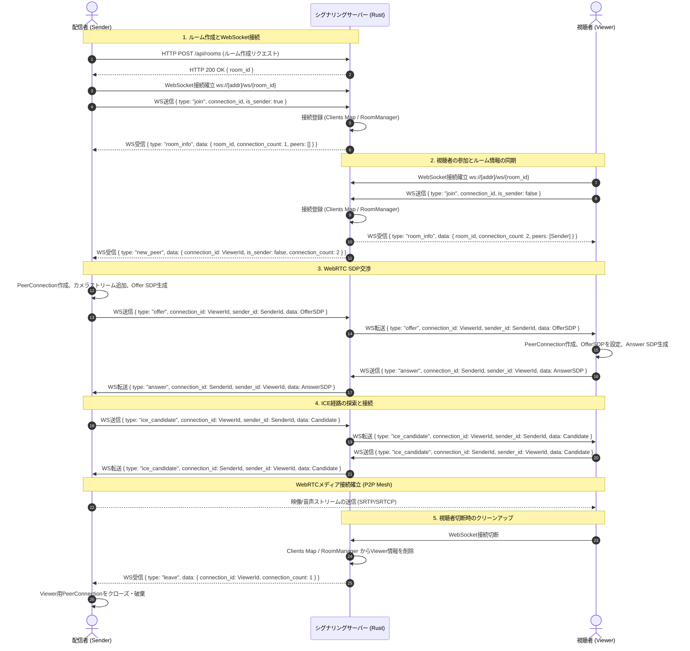

# システムアーキテクチャ仕様書 (System Architecture)

本ドキュメントは、Cam2WebRTCプロジェクトの全体構造、サーバー側コンポーネント、状態管理、およびWebRTC接続シーケンスについて定義します。

---

## 1. システム概要

Cam2WebRTCは、カメラ映像をリアルタイムに配信するための完全オフライン対応WebRTCシステムです。
単一の配信者（Sender）から複数の視聴者（Viewer）に対してリアルタイム映像を低遅延で配信する「1対多（1onN）」配信モデルを採用しています。

### 特徴
- **P2P Mesh方式**: サーバーがメディアデータを中継するのではなく、シグナリング完了後に配信者と各視聴者の間で直接P2P（Mesh）接続を確立して映像を伝送します。
- **オールインワン設計**: シグナリングサーバー、静的ファイル配信サーバー、簡易STUNサーバー、簡易TURNサーバーが単一のRustプロセスとして動作します。
- **完全オフライン動作**: インターネット接続がないローカルネットワーク（LAN）内でも動作するように設計されています。

---

## 2. サーバー構成

サーバーはRust言語で実装され、非同期ランタイム `tokio` およびWebサーバーフレームワーク `warp` をベースに構築されています。

```mermaid
graph TD
    subgraph Client [クライアント層]
        Sender[配信者 (sender.html)]
        Viewer[視聴者 (viewer.html)]
    end

    subgraph Server [Cam2WebRTC サーバープロセス]
        Warp[Warp HTTP/WS Server]
        STUN[STUN Server (UDP 3478)]
        TURN[TURN Server (UDP 3479)]
        
        RoomMgr[RoomManager (状態管理)]
        Clients[Clients Map (WebSocket接続管理)]
    end

    %% 通信関係
    Sender <-->|HTTPS / WSS| Warp
    Viewer <-->|HTTPS / WSS| Warp
    
    Sender <-->|UDP Binding| STUN
    Viewer <-->|UDP Binding| STUN
    
    Sender -.->|UDP Relay (Mock)| TURN
    Viewer -.->|UDP Relay (Mock)| TURN
    
    Warp <--> RoomMgr
    Warp <--> Clients
    
    %% P2Pメディアチャネル
    Sender <==>|P2P WebRTC Media (DTLS/SRTP)| Viewer
```

### コンポーネント役割

1. **Warp Webサーバー (TCP 8080/HTTPS)**:
   - クライアント用静的ファイル（`sender.html`, `viewer.html`）の配信。
   - ルーム作成や設定取得用のREST APIの提供。
   - 双方向シグナリング用のWebSocketエンドポイント（`/ws/{room_id}`）のハンドリング。
2. **STUNサーバー (UDP 3478)**:
   - クライアントのNAT通過（ICE候補解決）に必要な、パブリック/ローカルなIP・ポート（Mapped Address）を返すサービス。
3. **TURNサーバー (UDP 3479 - モック実装)**:
   - NATの種類（Symmetric NATなど）によって直接P2P接続が不可能な場合にメディアデータを中継するためのサーバー。
   - *注: 現行実装ではパケットの転送機能は未実装（ログ出力のみ）です。*
4. **RoomManager (メモリ内状態)**:
   - アクティブなルームの管理。
   - ルーム内の各ピア（配信者、視聴者）の接続情報（`ConnectionInfo`）の保持。
   - シグナリングメッセージのルーティングロジックの実装。
5. **Clients Map (メモリ内状態)**:
   - WebSocket接続IDと送信チャネル（`mpsc::UnboundedSender`）のマッピング。

---

## 3. スレッド・非同期モデルと状態管理

サーバーは非同期タスク（Green threads）モデルを採用しており、並行処理を安全に行うために以下のデータ構造を使用しています。

- **`Clients` (`Arc<RwLock<HashMap<String, mpsc::UnboundedSender<Message>>>>`)**:
  アクティブなWebSocketコネクションを保持します。接続IDをキーに、メッセージ送信用チャネルのSenderを格納しています。複数タスクから読み書きされるため `RwLock` で保護されています。
- **`RoomManager` (`Arc<RwLock<RoomManager>>`)**:
  ルーム全体のトポロジーおよびシグナリングの状態をスレッド安全に管理します。
- **非同期タスク (Tokio Tasks)**:
  - メインスレッド: Warpサーバーを起動し、HTTPおよびWebSocketリクエストをリスンします。
  - STUNサーバースレッド: 別途UDPソケットをバインドし、独立したループでリクエストを処理します。
  - TURNサーバースレッド: STUNと同様に、別ポートのUDPソケットをバインドして動作します。

---

## 4. 接続シグナリングフロー

WebRTC接続を確立するまでの、配信者、シグナリングサーバー、視聴者間の詳細な通信シーケンスです。



### シーケンス詳細
- **ルーム作成 (ステップ 1-6)**: 配信者はHTTPリクエストによりUUID形式のルームIDを取得後、WebSocket接続へ移行し、自身を`is_sender: true`として登録します。
- **ピア参加通知 (ステップ 7-10)**: 視聴者が同じルームIDのWebSocketに参加すると、サーバーは最新のルーム内ピア一覧を視聴者に返し、同時に配信者に対して新しいピアが参加したことを通知します。
- **1onN Offer自動作成 (ステップ 11-15)**: 配信者は `new_peer` メッセージを受け取るたびに、**該当の視聴者ID専用**の `RTCPeerConnection` を動的に生成し、SDP Offerを送信します。これにより、視聴者数(N)に対してN個の独立したP2Pコネクションが確立されます（Mesh型トポロジー）。
- **接続経路収集 (ステップ 16-19)**: 配信者と視聴者は、STUNサーバーを利用してそれぞれの候補アドレス（Candidate）を収集し、WebSocketシグナリング経由で相手に転送します。
